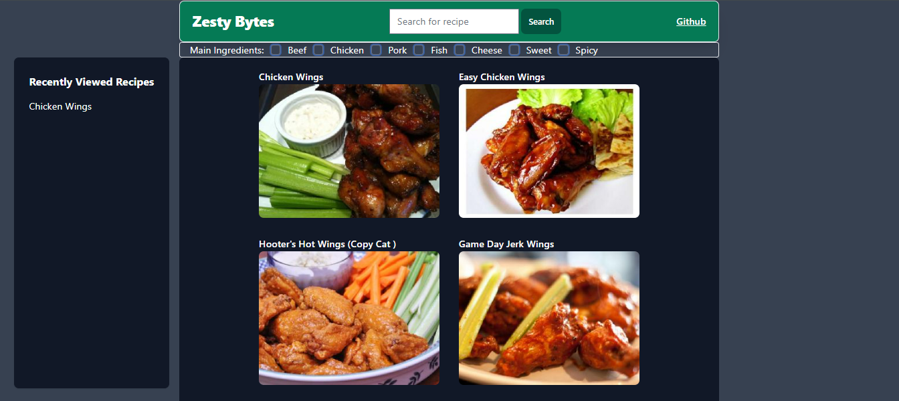
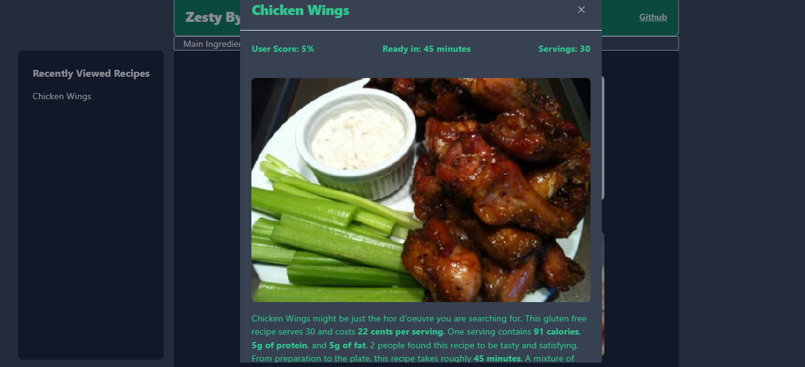

# Zesty-Bytes

## Description

**Project 1 for Vanderbilt Coding Bootcamp**

Our project focuses on delivering a user-friendly experience for snack enthusiasts searching for finger-food recipes. Our streamlined platform eliminates the hassle of ads and unnecessary content, ensuring a quick and efficient recipe search. Users can easily search by recipe name and view six curated options with images. Alternatively, a unique checkbox system allows ingredient-based searches for those with specific preferences.

The search bar features a convenient history of recent searches for quick access. Upon selecting a recipe, users are presented with a modal displaying essential details such as cook time, rating, and serving size alongside an engaging image. Our commitment to transparency is showcased on the home page, where a direct link to our GitHub repository highlights project contributors and their role as code contributors, fostering a collaborative community. Our goal is to provide a seamless and enjoyable snacking experience for users seeking hassle-free access to finger-food recipes.

## Table of Contents 

- [Usage](#usage)
- [Credits](#credits)
- [License](#license)
- [Features](#features)

## Usage

### Instruction:
* Search for a desired recipie by name in the input text area, by ingredient checkboxes you want to make sure are included, or both 
* If you've already viewed a recipe, you can also click on one you would like to revisit in the "recently viewed section
* Click on one of the options that display that you're interested in and a modal will show with the recipe information

### Deployed URL:

https://warhawk1950.github.io/Zesty-Bytes/

### Screenshot:

## Credits

### Collaborators: 
* [Andrue Desmarais](https://github.com/AndrueGage)
* [Jess Skelton](https://github.com/jskelly8)
* [Justin Hodges](https://github.com/Justinh144)
* [Joseph Padilla](https://github.com/warhawk1950)

Help with debugging/troubleshooting previous localStorage display from [Kevin Dallas Yatsinko](https://github.com/okni-c)

README template used from: https://coding-boot-camp.github.io/full-stack/github/professional-readme-guide edX Boot Camps LLC. (2022, October 27). Professional readme guide. Professional README Guide | The Full-Stack Blog. https://coding-boot-camp.github.io/full-stack/github/professional-readme-guide

## License

MIT License

## Features

* HTML
* CSS
* Flowbite
* JavaScript
* Server-Side API (https://spoonacular.com/food-api)
